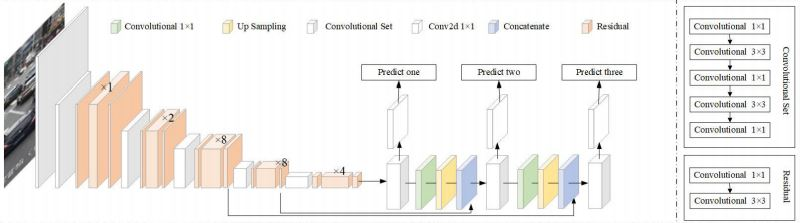

# Automatic Number plate Detection
Number plate recognition is one of the most crucial tasks which can benefit us in every way. It has already been widely adopted by many countries for surveillance purposes but in India where the size of the number plate is not fixed and most of the CCTV cameras are not of high resolution- ANPR remains a challenge to be solved. Automatic Number plate detection is very challenging as the detection of regions containing number plates and recognizing them varies from place to place. So, we have come up with a solution for it using YOLOv3 and Pytesseract.

# Dataset
This is one of the hardest part to work out. Since there is no any standard indian number plated dataset is available, I downloaded the the dataset from kaggle and  annotated it manually. you can download the dataset from [here](https://www.kaggle.com/scholngusmaximus/numberplate-bounding-box-india-eu-brazil-us)

# YOLOv3 Architecture


The YOLOv3 algorithm first divides an image into a grid. Each grid cell predicts some number of boundary boxes (sometimes referred to as anchor boxes) around objects that score highly with the aforementioned predefined classes. Each boundary box has a respective confidence score of how accurate it assumes that prediction should be, and detects only one object per bounding box. You can download the darknet pretrained model from [here](https://github.com/pjreddie/darknet)

# Character recognition
Pytesseract has been used for optical character recognition from the cropped Number plate . It can be installed using pip. <br>
```pip install pytesseract```

for more details, please have a look at official github [repository](https://github.com/madmaze/pytesseract).

# Gidelines
#### To detect and crop the number plate , run the following command.

```python path/to/recognition.py -i path/to/test-image -c path/to.yolov3.cfg -w path/to/model -c path/to/obj.names```

You can download the pretrained model from my drive [link](https://drive.google.com/file/d/1hdMzTUKlFX5PZLy5xCfGehBb6_MfhTLl/view?usp=sharing).

#### For number recognition, run the following command

```python path/to/ocr.py -i path/to/cropped-image```


# Demo

**Number plate detection:**

****


**Number recognition:**

****


# References

* [**https://arxiv.org/pdf/1507.05717.pdf**](https://arxiv.org/pdf/1507.05717.pdf)
* [**https://www.cs.toronto.edu/~graves/icml_2006.pdf**](https://www.cs.toronto.edu/~graves/icml_2006.pdf)
* [**https://towardsdatascience.com/intuitively-understanding-connectionist-temporal-classification-3797e43a86c**](https://towardsdatascience.com/intuitively-understanding-connectionist-temporal-classification-3797e43a86c)
* [**https://github.com/AlexeyAB/darknet#pre-trained-models**](https://github.com/AlexeyAB/darknet#pre-trained-models)
* [**https://www.kaggle.com/scholngusmaximus/numberplate-bounding-box-india-eu-brazil-us**](https://www.kaggle.com/scholngusmaximus/numberplate-bounding-box-india-eu-brazil-us)

---

If you like the project ans you want to use it for your own purpose, feel free to use it. In case you want to extend this project then  create a PR and then we will take care it from there. 

**Couple of things to get you started.**

* You can use YOLO V4 instead of YOLOV3.
* If you can come up with a new annnotated dataset, It would be benefitial for Indian CV community.
